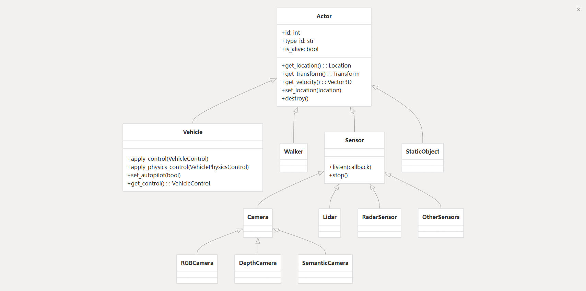

# Dig-Into-Carla Actor

> Older men declare war. But it is youth that must fight and die. 

| Property / Method             | Description                                    |
| ----------------------------- | ---------------------------------------------- |
| **id**                        | Unique identifier                              |
| **type\_id**                  | Type identifier (e.g., "vehicle.ford.mustang") |
| **attributes**                | Dictionary of blueprint attributes             |
| **is\_alive**                 | Whether the actor still exists                 |
| **get\_location()**           | Returns the actor's location                   |
| **get\_transform()**          | Returns the actor's transform                  |
| **get\_velocity()**           | Returns the actor's velocity                   |
| **set\_location(location)**   | Teleports the actor to a new location          |
| **set\_transform(transform)** | Teleports the actor to a new transform         |
| **destroy()**                 | Destroys the actor                             |
