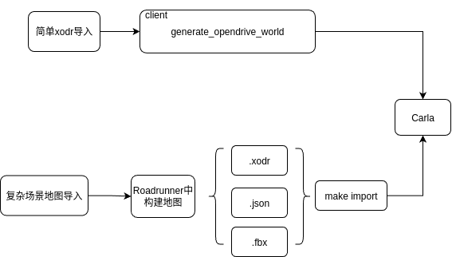
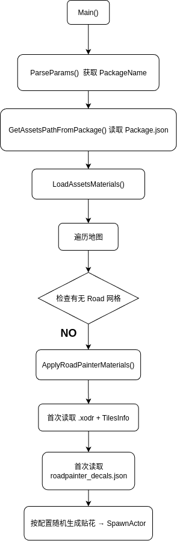

# OpenDRIVE 独立模式

此功能允许用户直接将任何 OpenDRIVE 文件作为 CARLA 地图加载，无需额外资源。模拟器会自动生成可供车辆行驶的道路网格。

* [**概述**](https://www.notion.so/CARLA-24fce8cf244480e7bfbce37a64b271ab?pvs=21)
* [**运行独立地图**](https://www.notion.so/CARLA-24fce8cf244480e7bfbce37a64b271ab?pvs=21)
* [**网格生成**](https://www.notion.so/CARLA-24fce8cf244480e7bfbce37a64b271ab?pvs=21)

## 概述

该模式仅使用一个 OpenDRIVE 文件即可运行完整的仿真，无需其他几何或资产。模拟器会读取 OpenDRIVE 文件，并程序化生成一个临时 3D 网格来进行仿真。

生成的网格以最简方式描述道路定义。所有道路元素都会与 OpenDRIVE 文件一致，但除此之外，其余区域都是空的。为防止车辆掉落到空白区域，采取了两种措施：

* 在交通复杂的路口处，道路车道会稍微加宽。
* 在道路边界创建可见的“墙”作为最后的安全措施。

交通信号灯、停车标志和让行标志会实时生成。行人会在地图上的人行道与人行横道上行走。这些元素及道路上的细节全部基于 OpenDRIVE 文件。由于独立模式直接使用 `.xodr` 文件，因此文件中的任何问题都会反映到仿真中，尤其是在多车道交汇的路口可能出现问题。

## 运行独立地图

加载 OpenDRIVE 文件只需通过 API 调用 [`client.generate_opendrive_world()`](https://www.notion.so/python_api.md#carla.Client.generate_opendrive_world)。

该方法会生成新地图，并阻塞仿真直到准备完成。它有两个参数：

* `opendrive`：OpenDRIVE 文件的内容（字符串形式）。
* `parameters`（可选）：[carla.OpendriveGenerationParameters](https://www.notion.so/python_api.md#carla.OpendriveGenerationParameters) 类型，用于设置网格生成参数。

参数说明：

* `vertex_distance`（默认 2.0 米）— 网格顶点之间的距离。越大越不精确，但太小会导致网格过重。
* **`max_road_length`**（默认 50.0 米）— 网格分段的最大长度。越小越容易被剔除渲染，但分段过多会影响性能。
* **`wall_height`**（默认 1.0 米）— 道路边界额外墙的高度，防止车辆掉落。
* **`additional_width`**（默认 0.6 米，即每侧 0.3 米）— 路口车道额外加宽量。
* **`smooth_junctions`**（默认 True）— 若为 True，会平滑路口网格，减少多车道汇合处的误差；若为 False，则严格按 OpenDRIVE 定义生成。
* **`enable_mesh_visibility`**（默认 True）— 若为 False，网格不会渲染，可减少渲染负担。

为了方便测试，在 `PythonAPI/util/` 目录下的 `config.py` 脚本中增加了 `-x` 或 `--xodr-path` 参数，直接传入 `.xodr` 文件路径即可，例如：

```python
python3 [config.py](<http://config.py/>) -x opendrive/TownBig.xodr
```

`client.generate_opendrive_world()` 需要的是 **OpenDRIVE 文件的内容（字符串）**，而 `config.py` 需要的是 **文件路径**。

如果出现 `opendrive could not be correctly parsed` 错误，请确保 `CarlaUE4/Content/Carla/Maps/OpenDrive/` 目录有写权限。

## 网格生成

网格生成是此模式的核心。生成的网格必须平滑且符合定义，因此该过程持续优化中，特别是路口部分，避免高低车道遮挡等误差。

此外，地图并非作为一个整体网格生成，而是分成多个部分，以便不渲染不可见部分，从而节省性能，同时也能生成超大地图并将问题限制在局部。

当前的注意事项：

* **路口平滑**：默认开启，可减少倾斜路口的遮挡问题，但会修改原始网格。
* **人行道高度**：目前统一固定高度，保证碰撞检测，因为 RoadRunner 不会将该高度导出到 OpenDRIVE 文件。

## 源码解析：

解析器源码：Libarla/Source/carla/opendrive/parser/OpenDriveParser.{h,cpp}

功能： 将.xodr解析为CARLA 路网/地标 (交通标志、信号灯作为landmarks)

## **在关卡里批量生成 Static Mesh**（静态网格体）

PrepareAssetsForCookingCommandlet.{h,cpp}

**在关卡里批量生成 Static Mesh**

`SpawnMeshesToWorld` 会根据传入的静态网格资产路径 `AssetsPaths`，在当前 `World` 中生成 `AStaticMeshActor`，并按需要：

* 过滤只加载当前地图块（Tile）的 Mesh
* 给不同类型的 Mesh 设置 Carla 的材质
* 调整碰撞设置
* 最终把生成的所有 Mesh Actor 返回（`TArray<AStaticMeshActor*>`）

1. 准备生成环境

```
const FTransform ZeroTransform = FTransform();
AssetsObjectLibrary = UObjectLibrary::CreateLibrary(UStaticMesh::StaticClass(), false, GIsEditor);
```

* `ZeroTransform` 是默认位置、旋转、缩放的变换（生成到原点，后续可调整）。
* `UObjectLibrary` 用来批量加载静态网格（`UStaticMesh`）资产。

2. 加载静态网格资产

   ```
   AssetsObjectLibrary->LoadAssetDataFromPaths(AssetsPaths);
   AssetsObjectLibrary->LoadAssetsFromAssetData();
   AssetsObjectLibrary->GetAssetDataList(MapContents);
   ```

   从 `AssetsPaths` 读取所有 `.uasset` 的 `UStaticMesh` 信息到 `MapContents`。
3. Tile 名过滤

   ```cpp
   if (i != -1) {
       TileName = FString::Printf(TEXT("_Tile_%d_%d"), i, j);
   }
   ```

   如果传入了 Tile 坐标 `(i, j)`，则只生成属于该 Tile 的 Mesh。
4. 生成 Static Mesh Actor

   ```
   MeshActor = World->SpawnActor<AStaticMeshActor>(..., ZeroTransform);
   MeshComponent->SetStaticMesh(MeshAsset);
   ```

   在 `World` 中生成一个 `AStaticMeshActor`。给Actor的 `UStaticMeshComponent` 绑定加载的 Mesh 资产。
5. 碰撞设置

   ```cpp
   BodySetup->CollisionTraceFlag = CTF_UseComplexAsSimple;
   ```

   把网格的碰撞方式改成“用复杂碰撞做简单碰撞”，更精确（但可能更耗性能）。

## Static Mesh生成贴图

在 `ULoadAssetMaterialsCommandlet()` 构造函数中，用 `ConstructorHelpers::FObjectFinder`

找到 `RoadPainterPreset` 蓝图类。创建了一个 `DecalNamesMap`，

把纹理类别名（如 `"dirt1"`、`"crack3"`）映射到实际的 `MaterialInstanceConstant` 资产路径。

这些路径都是 `/Game/Carla/Static/Decals/...` 下的素材，用于不同道路效果：泥土、裂缝、井盖、油渍、胎痕等。

在Main函数中调用获取静态物体和地图的路径

Main->LoadAssetsMaterials->ApplyRoadPainterMaterials->Load

```
int32 ULoadAssetMaterialsCommandlet::Main(const FString &Params)
{
  // 解析命令行参数（PackageName=xxx）
  FPackageParams PackageParams = ParseParams(Params);
  // 获取静态元素和地图
  FAssetsPaths AssetsPaths = GetAssetsPathFromPackage(PackageParams.Name);
  LoadAssetsMaterials(PackageParams.Name, AssetsPaths.MapsPaths);   //调用 LoadAssetsMaterials 处理所有地图。
#if WITH_EDITOR
  UEditorLoadingAndSavingUtils::SaveDirtyPackages(true, true);      // 保存修改。
#endif
  return 0;
}
```

调用位置：LoadAssetMaterialsCommandlet.cpp

**批量为地图（将地图分块 Tile ）添加预设的路面贴花（Decal），并按照配置文件读取贴花分布规则贴纹理**。

遍历地图，检查是否包含 "Road" 网格（判断是否需要生成道路贴花）如果需要且是 Tile 地图，调用 `ApplyRoadPainterMaterials` 生成贴花。

相当于一个**纹理类型到材质资产路径的字典**，方便后续加载。

```
 void ULoadAssetMaterialsCommandlet::LoadAssetsMaterials(const FString &PackageName, const TArray<FMapData> &MapsPaths)
{
  // Load World
  FAssetData AssetData;
  // 通过UObjectLibrary加载MapsPaths中所有的UWorld对象。
  MapObjectLibrary = UObjectLibrary::CreateLibrary(UWorld::StaticClass(), false, GIsEditor);
  const FString DefaultPath = TEXT("/Game/") + PackageName + TEXT("/Maps/");
  MapObjectLibrary->AddToRoot();
  for (auto &&data : MapsPaths)
  {
    MapObjectLibrary->LoadAssetDataFromPath(*data.Path);
  }
  MapObjectLibrary->LoadAssetsFromAssetData();
  MapObjectLibrary->GetAssetDataList(AssetDatas);
  if (AssetDatas.Num() > 0)
  {
    int32 NumAssets = AssetDatas.Num();
    //如果这个地图是分块的（名字含 _Tile_），MapsPaths 里同一个目录下会列出多个 .umap 文件；
    //程序会逐个 Tile 加载处理
    for (int32 i = 0; i < NumAssets; ++i) {
      // Extract first asset found in folder path (i.e. the imported map)
      AssetData = AssetDatas.Pop();
      World = Cast<UWorld>(AssetData.GetAsset());
      if (World != nullptr) {
        World->InitWorld();
        // 检查当前世界中是否有道路网格，以便生成贴花。
        TArray<AActor*> FoundActors;
        UGameplayStatics::GetAllActorsOfClass(World, AStaticMeshActor::StaticClass(), FoundActors);
        bool HasRoadMesh = false;
        for (int32 j = 0; j < FoundActors.Num() && HasRoadMesh == false; ++j) {
          AStaticMeshActor *MeshActor = Cast<AStaticMeshActor>(FoundActors[j]);
          if (MeshActor->GetName().Contains("Roads") || MeshActor->GetName().Contains("Road")){
            HasRoadMesh = true;
          }
        }
        if (HasRoadMesh == true) {
          bool IsTiledMap = World->GetName().Contains("_Tile_", ESearchCase::Type::CaseSensitive);
          // 如果需要且是 Tile 地图，调用 ApplyRoadPainterMaterials 生成贴花
          ApplyRoadPainterMaterials(World->GetName(), PackageName, IsTiledMap);
        }
#if WITH_EDITOR
        UEditorLoadingAndSavingUtils::SaveDirtyPackages(true, true);  //保存修改
#endif
      }
    }
  }
}
```

调用**ApplyRoadPainterMaterials**函数会在地图加载后，对该地图的道路区域生成随机分布的纹理。

```
void ULoadAssetMaterialsCommandlet::ApplyRoadPainterMaterials(const FString &LoadedMapName, const FString &PackageName, bool IsInTiles)
{
    // 1. 首次进入时读取 OpenDrive 数据与 TilesInfo
  if (IsInTiles == true) {   // 如果地图是 Tile 格式名字形如 map_Tile_X_Y）

    if (FilledData == false) {

      // As the OpenDrive file has the same name as level, build the path to the
      // xodr file using the label name and the game content directory.
      FString MapName = LoadedMapName;
      if (IsInTiles)
      {
        int32 idx = MapName.Find("_Tile_");
        if(idx > -1)
        {
          MapName = MapName.Mid(0, idx);
        }
      }
      // 先从 .xodr 文件加载道路拓扑（UOpenDrive::LoadXODR + OpenDriveParser::Load）。
      const FString XodrContent = UOpenDrive::LoadXODR(MapName);
      XODRMap = carla::opendrive::OpenDriveParser::Load(carla::rpc::FromLongFString(XodrContent));

      // Acquire the TilesInfo.txt file for storing the tile data (offset and size)
      TArray<FString> FileList;
      IFileManager::Get().FindFilesRecursive(FileList, *(FPaths::ProjectContentDir() + "/" + PackageName), *(FString("TilesInfo.txt")), true, false, false);

      FString TxtFile;
      if (FFileHelper::LoadFileToString(TxtFile, *FileList[0]) == true) {

        TArray<FString> Out;
        TxtFile.ParseIntoArray(Out, TEXT(","), true);
        // 从 TilesInfo.txt 读取第一个 Tile 的中心坐标和 Tile 尺寸，存到 TileData。
        TileData.FirstTileCenterX = (float) FCString::Atoi(*Out[0]);
        TileData.FirstTileCenterY = (float) FCString::Atoi(*Out[1]);
        TileData.Size = (float) FCString::Atoi(*Out[2]);
      }
      else {
        UE_LOG(LogTemp, Warning, TEXT("Could not read TilesInfo.txt file"));
        return;
      }

      FilledData = true;
    }

    TArray<FString> StringArray = {};
    LoadedMapName.ParseIntoArray(StringArray, TEXT("_"), false);
    // 2. 根据 Tile 名解析位置
    // 从地图名解析出当前 Tile 的 (XIndex, YIndex)。
    int32 XIndex = FCString::Atoi(*StringArray[StringArray.Num() - 2]);
    int32 YIndex = FCString::Atoi(*StringArray[StringArray.Num() - 1]);
    FVector TilePosition;
    // This means it's the initial tile (mymap_Tile_0_0)
    // 计算该 Tile 的世界范围（Min/Max X/Y）。
    TilePosition.X = TileData.FirstTileCenterX + (TileData.Size * (float)XIndex);
    TilePosition.Y = TileData.FirstTileCenterY - (TileData.Size * (float)YIndex);
    TilePosition.Z = 0.0f;

    float HalfSize = TileData.Size / 2.0f;

    float MinXSize = (TilePosition.X - HalfSize);
    float MaxXSize = (TilePosition.X + HalfSize);

    float MinYSize = (TilePosition.Y - HalfSize);
    float MaxYSize = (TilePosition.Y + HalfSize);
    // 3. 读取 Decal 配置文件

    // 只在第一次执行时读取 roadpainter_decals.json
    // 配置文件决定哪些类型的纹理、每种生成数量、缩放范围、旋转范围等。
    if (ReadConfigFile == true) {

      DecalsProperties = ReadDecalsConfigurationFile(PackageName);
      ReadConfigFile = false;
    }

  
    carla::geom::Location DecalLocation;

    //Store results for avoiding excessive calculations
    float MinXSizeCm = MinXSize * 100.0f;
    float MaxXSizeCm = MaxXSize * 100.0f;
    float MinYSizeCm = MinYSize * 100.0f;
    float MaxYSizeCm = MaxYSize * 100.0f;

    float TileSizeCm = TileData.Size * 100.0f;
    float TileWorldLocationX = TileData.FirstTileCenterX * 100.0f;
    float TileWorldLocationY = TileData.FirstTileCenterY * 100.0f;

    for (int32 i = 0; i < DecalsProperties.DecalMaterials.Num(); ++i) {

      for (int32 j = 0; j < DecalsProperties.DecalNumToSpawn[i]; ++j) {
        // 对每种纹理类型，按配置文件的数量随机选取 Tile 内位置。
        DecalLocation.x = FMath::RandRange(MinXSize, MaxXSize);
        DecalLocation.y = FMath::RandRange(MinYSize, MaxYSize);
        DecalLocation.z = 0.0f;
  
        // 使用 OpenDrive 地图找到最近的道路点（GetClosestWaypointOnRoad），保证纹理贴在路上。
        auto Wp = XODRMap->GetClosestWaypointOnRoad(DecalLocation);
        carla::geom::Location RoadLocation = XODRMap->ComputeTransform(Wp.get()).location;
        FVector FinalLocation(RoadLocation);

        // 检查纹理是否落在当前 Tile 的边界内。
        if (FinalLocation.X > MinXSizeCm && FinalLocation.X < MaxXSizeCm) {

          if (FinalLocation.Y > MinYSizeCm && FinalLocation.Y < MaxYSizeCm) {

            FRotator FinalRotation(XODRMap->ComputeTransform(Wp.get()).rotation);

            // Transform the location from world coords to tile coordinates.
            // The location we get is the location of the XODR waypoint, which is in WORLD coordinates
            // The Y coordinates are reversed! -Y = Y and Y = -Y
            FinalLocation.X -= TileWorldLocationX + (XIndex * TileSizeCm);
            FinalLocation.Y -= TileWorldLocationY - (YIndex * TileSizeCm);

            FActorSpawnParameters SpawnParams;
            SpawnParams.SpawnCollisionHandlingOverride = ESpawnActorCollisionHandlingMethod::AlwaysSpawn;
            SpawnParams.bNoFail = true;
            // 使用 World->SpawnActor<ADecalActor> 生成纹理
            ADecalActor* Decal = World->SpawnActor<ADecalActor>(FinalLocation, FRotator(), SpawnParams);
            Decal->SetDecalMaterial(DecalsProperties.DecalMaterials[i]);

            // 随机缩放（X、Y）
            float RandScale = FMath::RandRange(DecalsProperties.DecalMinScale, DecalsProperties.DecalMaxScale);
            FVector FinalDecalScale;
            FinalDecalScale.X = DecalsProperties.DecalScale.X + RandScale;
            FinalDecalScale.Y = DecalsProperties.DecalScale.Y + RandScale;
            FinalDecalScale.Z = 1.0f;
            Decal->SetActorScale3D(FinalDecalScale);

            // 随机旋转（Yaw）
            float RandomYaw = FMath::RandRange(0.0f, DecalsProperties.DecalRandomYaw);
            FinalRotation.Yaw += RandomYaw;
            FinalRotation.Pitch = -90.0f;   //固定 Pitch 为 -90°（贴在地面上）
            Decal->SetActorRotation(FinalRotation);
            Decal->SetActorLabel("RoadDecal", true);  //贴上对应材质，命名为 "RoadDecal"
          }
        }
      }
    }

#if WITH_EDITOR
  UEditorLoadingAndSavingUtils::SaveDirtyPackages(true, true);
#endif
  }
}
```


