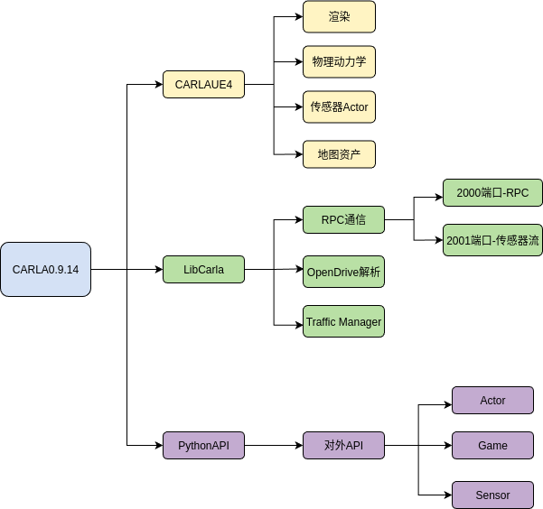
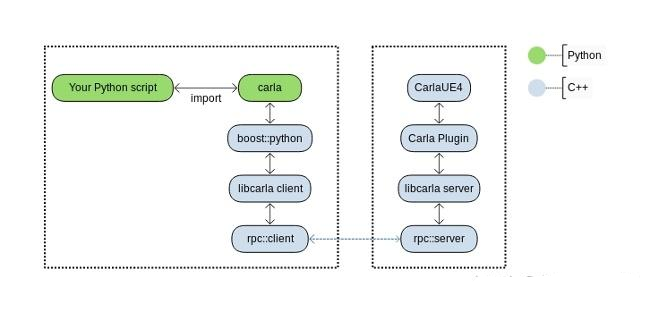
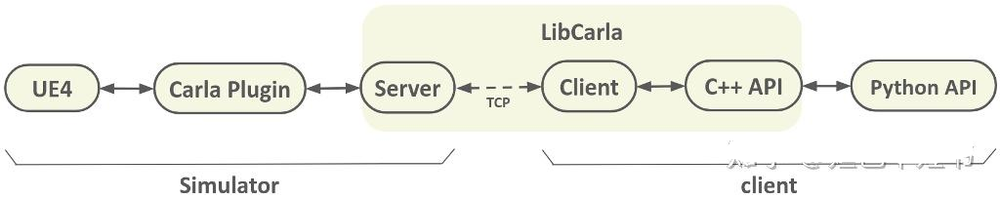
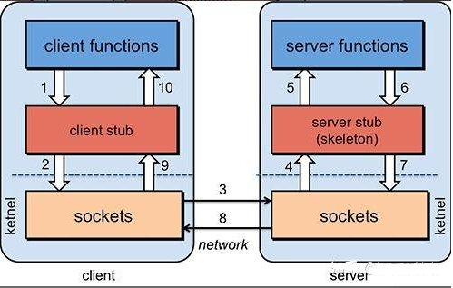

# Dig-Into-Carla Source

> Time stays long enough for anyone who will use it.

Carla的源码是按照Unreal Engine插件的形式来实现的.

UE提供了标准插件的版本，支持将工程以插件的形式放到Unreal Engine里面。

所以Carla编译版本的源码存放在Unreal->CarlaUE4->Plugins->Carla->Source

Carla自动驾驶模拟器是Client-Server架构。

Server端一部分是UnrealEngnie，一部分是Carla ,使用C++实现。[Server端](https://zhida.zhihu.com/search?content_id=194107983&content_type=Article&match_order=2&q=Server%E7%AB%AF&zhida_source=entity)负责和仿真相关的功能：sensor 渲染，物理计算，更新world state和actor等。

Client端是Carla，由多个Client组成，支持多个Client同时运行 ,一部分是C++实现的，一部分是python实现的。Client端控制actor的逻辑，设置world条件。

Client-Server之间的通信方式采用的是RPC框架，TCP协议。

LibCarla源码在.../LibCarla/source/carla/rpc。

RPC（Remote Procedure Call）—[远程过程调用](https://www.zhihu.com/search?q=%E8%BF%9C%E7%A8%8B%E8%BF%87%E7%A8%8B%E8%B0%83%E7%94%A8&search_source=Entity&hybrid_search_source=Entity&hybrid_search_extra=%7B%22sourceType%22%3A%22article%22%2C%22sourceId%22%3A%22334657641%22%7D)，它是一种通过网络从远程计算机程序上请求服务，而不需要了解底层[网络技术](https://zhida.zhihu.com/search?content_id=194107983&content_type=Article&match_order=1&q=%E7%BD%91%E7%BB%9C%E6%8A%80%E6%9C%AF&zhida_source=entity)的协议。

