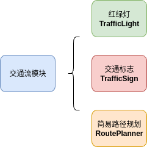
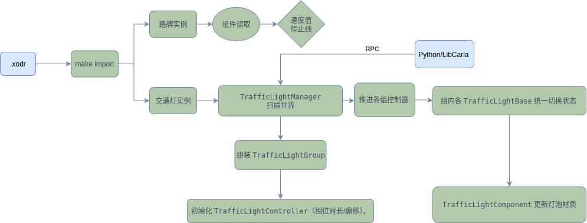

# 交通流

该模块负责交通设施(eg: 红绿灯、 限速 礼让 停止路牌) 以及服务器端的简易路径规划。

#### 模块总览

1、**TrafficLight**:

红绿灯本体 `TrafficLightBase`、
红绿灯组建`TrafficLightComponent`、
红绿灯控制 `TrafficLightController`、
红绿灯组合 `TrafficLightGroup`、
红绿灯全局注册/调度 `TrafficLightManager`、
红绿灯交互 `TrafficLightInterface`、
红绿灯状态枚举 `TrafficLightState`

2、TrafficSign:

交通标志（基类 `TrafficSignBase` + 通用组件 `SignComponent`；派生的 `SpeedLimit/StopSign/YieldSign` 组件读取 OpenDRIVE 信号参数，提供数值/触发区域）。

3、**RoutePlanner**：

基于地图路网（OpenDRIVE→内部路网）的**简易路径规划/取路点**工具，供服务器端需要时生成稀疏路径或连通性检查（与 C++ Traffic Manager 不同，后者在 LibCarla 侧管“车流”）。

### 路牌（标志）

* TrafficSignBase.h/.cpp
  交通标志**Actor 基类**：承载静态网格与公共属性（标志类型、可选触发盒/包围盒），统一被管理器发现与查询。
* SignComponent.h/.cpp

  标志**通用组件基类**：挂到 `TrafficSignBase` 上，封装读取 OpenDRIVE 信号属性、计算标志范围/触发体、向管理器注册等通用逻辑。
* topSignComponent.h /.cpp

  **限速牌组件**：从 OpenDRIVE/实例属性中读出**速度值**（km/h），向外暴露“本路段限速”。供客户端/算法查询。
* StopSignComponent.h /.cpp

  **停止（STOP）牌组件**：提供**停止线/触发区域**；
* YieldSignComponent.h /.cpp
  **让行（YIELD）牌组件**：同样提供触发/查询能力，标注优先关系。

#### 红绿灯（信号机）

* TrafficLightState.h

  红绿灯**状态枚举**：典型含 `Red / Yellow / Green / Off`
* TrafficLightBase.h / .cpp

  绿灯**Actor 基类**：

  * 持有当前**状态**、计时、是否冻结（time-frozen，用于录放或外部接管）。
  * 对外 API：`Get/SetState()`、`FreezeTime(bool)`、获取/设置每相位时长等。
  * 将状态变化同步到组件（材质亮灭/停止线可视化）。
* TrafficLightComponent.h/.cpp

  红绿灯**几何/灯泡组件**：

  * 解析灯头模型中的**灯泡网格**，管理每相位对应的**材质/发光**。
  * 计算/存储**停止线**、**受控车道**或**控制范围**（常用于 AI/规则系统检测“到线停车”）。
  * 提供射线/包围盒查询帮助函数。
* TrafficLightGroup.h/.cpp
  把同一交叉口/相同相位的多个 `TrafficLightBase` 编成组（同时变色）。管理**相位序列/互斥关系**（一组绿时其它组红），可设置**相位偏移**以模拟真实配时。
* TrafficLightManager.h/.cpp

  **全局管理器**：

  * **发现/注册**世界中的红绿灯和标志，构建组/路口关系。
  * **集中调度**：按时推进各组控制器；提供**冻结/解冻**、**强制设态**等外部控制入口（供 RPC/Python API 调用）。
  * **查询接口**：根据位置/道路段返回最近受控灯、查询某灯的停止线/受控范围；可含**调试绘制**（Debug helpers）。
* TrafficLightInterface.h
  UE 的 **`UInterface`**：为不同对象提供一套统一的交通灯交互方法（如获取/设定状态、取停止线等），便于蓝图/脚本/外部模块在不依赖具体类的情况下操作信号机。

#### 数据控制流

Python/LibCarla 可通过 RPC 调 `TrafficLightManager` 或直接对某 `TrafficLightBase` 状态、冻结、修改配时；车流（Traffic Manager, C++ 另一处模块）读取灯态以决定是否通行。

---

